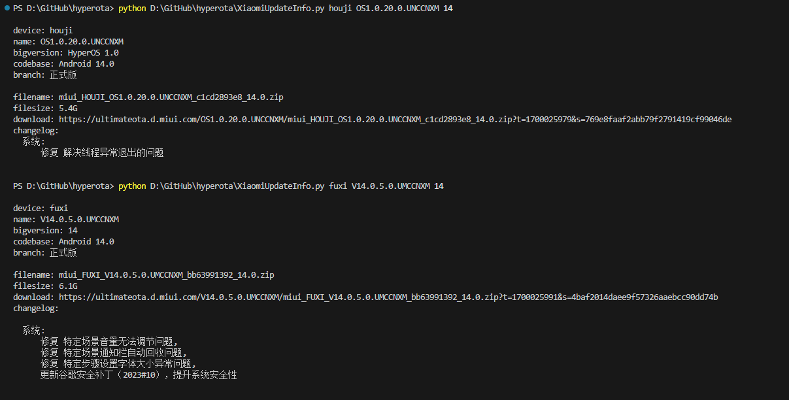

### Xiaomi Update Info

一个简单的 HyperOS/MIUI 更新链接获取脚本

通过 s:"1" 方式只能获取正式版下载链接, 获取开发版下载链接请使用 s:"2", 这需要登录拥有权限的账号

```
Requirements: pycryptodome, requests

Usage: XiaomiUpdateInfo.py codename rom_version android_version

Example: 
(1) XiaomiUpdateInfo.py houji OS1.0.29.0.UNCCNXM 14
(2) XiaomiUpdateInfo.py fuxi V14.0.5.0.UMCCNXM 14
```


参考来源: 

(1) https://github.com/HegeKen/MRData/blob/master/script/test2.py

(2) https://github.com/CMDQ8575/Xiaomi-Community-AutoTask/blob/main/xiaomi.py

实例:
<p></p>